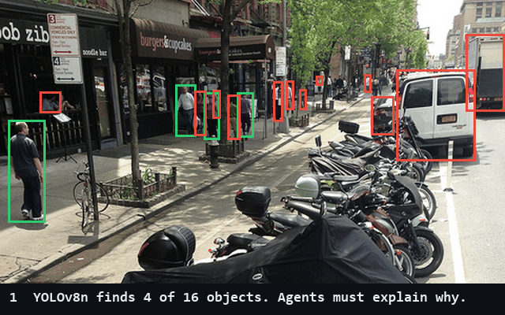

# Can an LLM Agent Correctly Report Where an Object Detector Fails?

    [](https://github.com/knh4abt/perception-triage-agent/actions/workflows/ci.yml)

In my last project ([driving-scene-segmentation](https://github.com/knh4abt/driving-scene-segmentation))
I analysed by hand where a segmentation model fails. Here I let an LLM agent write that
analysis, and check whether its report is correct.

I ran YOLOv8n on 200 COCO street images (person, car, bus, truck) and computed where it
fails. A local Llama 3.1 8B agent reads these results through tools and writes a report.
A second step, the Reviewer, checks the report against the computed numbers and sends it
back if something is wrong.

<p align="center">
  <br/>
  <sub>A real catch from the latest run (reports/run_log.json).</sub>
</p>

---

## Results

**The detector misses small objects.** Persons smaller than 32x32 pixels are found 37% of
the time, large persons 97%. The biggest gap: 227 of 360 small persons were missed.

<p align="center">
  <br/>
  <sub>000000490936.jpg, the hardest image: 4 of 16 objects found. Green: found. Red: missed.</sub>
</p>

| Class | Recall, small | Recall, medium | Recall, large |
|---|---:|---:|---:|
| person | 0.369 (227 of 360 missed) | 0.801 | 0.966 |
| car | 0.216 (58 of 74 missed) | 0.655 | 0.714 |
| bus | 0.167 (6 objects) | 0.375 | 0.875 |
| truck | 0.250 (8 objects) | 0.333 | 0.429 |

Mixing up classes is rare: a car was detected as a truck 4 times, a truck as a bus 2 times,
a truck as a car 2 times. Example: in `000000466416.jpg` (a city at night) all 12 cars are
about 15x6 pixels and none is found. The only "car" the detector reports is a rooftop.

| Class | Precision | Recall | TP | FP | FN |
|---|---:|---:|---:|---:|---:|
| person | 0.851 | 0.648 | 533 | 93 | 290 |
| car | 0.667 | 0.364 | 40 | 20 | 70 |
| bus | 0.786 | 0.500 | 11 | 3 | 11 |
| truck | 0.435 | 0.333 | 10 | 13 | 20 |
| all | 0.822 | 0.603 | 594 | 129 | 391 |

Settings: confidence 0.25, IoU 0.5, 985 labelled objects.

**The agent needed several fixes before its report was correct.** It always copied the
numbers correctly, but it made mistakes in what it said about them:

| Run | Problem | Fix |
|---|---|---|
| 1 | Said the class mix-ups the wrong way round, and did not mention small persons | Added a Reviewer step |
| 2 | The Reviewer (also the 8B model) accepted a report like that | Added a check in code: the biggest failure must be mentioned |
| 3 | Wrote "360 small persons missed". 360 is the total, 227 were missed | The tools now return the missed count, and the check requires the exact number |
| 4 | My own bug: two checks disagreed, because 227 was not saved in metrics.json | Saved the missed count in metrics.json |
| 5 | Changed the heading format and made up numbers in the list of hard images | Code now writes all tables; the model only writes the text |
| 6 | Report passed all checks the first time | |

What I learned: the more of the work I moved from the model to code, the more reliable
the report got.

Example report: [`reports/report.md`](reports/report.md).

---

## How it works

```
download_data.py   download 200 COCO images and labels
detector.py        run YOLOv8n            -> predictions.json
metrics.py         compare with labels    -> metrics.json
tools.py           4 tools the agent can call, served over MCP (mcp_server.py)
graph.py           analyst calls the tools and writes the text
                   reviewer checks the text, sends it back at most 2 times
report.py          code adds the tables   -> report.md
```

The Reviewer checks:

- every number in the text appears in metrics.json
- the biggest failure is mentioned with the exact number missed
- with the LLM: statements like "A detected as B" match the facts

If problems remain after 2 rewrites, the report is still written, with the open problems
listed at the end.

---

## Run it

You need Python 3.11 and [Ollama](https://ollama.com). No GPU needed.

```bash
python -m venv .venv
source .venv/Scripts/activate        # Linux/macOS: source .venv/bin/activate
pip install -r requirements.txt
ollama pull llama3.1:8b

python -m scripts.download_data                                  # about 60 MB
python -m triage_agent.cli --images data/sample --out reports    # about 2 minutes
python -m pytest -q                                              # 19 tests, no LLM needed
```

With Docker (Ollama keeps running on your machine):

```bash
docker build -t perception-triage .
docker run --rm -v "$PWD/data:/app/data" -v "$PWD/reports:/app/reports" perception-triage
```

On every push, GitHub Actions runs the linter, the tests and a Docker build.

---

## Limitations

- Every result comes from one run. The agent can write a different report on the next run.
- The number check only tests that a number exists, not that it is used correctly. Run 3
  passed it.
- 200 images is a small sample. Bus (22 objects) and truck (30) results are uncertain.
- I report precision and recall at one confidence threshold, not mAP.
- The labels come from a copy on Hugging Face, because the official COCO server was blocked
  on my network. The script checks that the copy matches the official counts.

## Next steps

- Run the agent many times and measure how often each check fails.
- Try a larger LLM and larger YOLOv8 models.
- Check what a number means, not only that it exists.

---

## Project structure

```
configs/default.yaml     settings: paths, thresholds, LLM
scripts/download_data.py downloads the data
triage_agent/            detector, metrics, tools, MCP server, agent graph, review, report, CLI
tests/                   unit tests (no LLM calls)
Dockerfile               container image
.github/workflows/       CI
```

## References

- Lin et al., Microsoft COCO: Common Objects in Context, ECCV 2014 (annotations CC BY 4.0)
- Ultralytics YOLOv8, https://github.com/ultralytics/ultralytics (AGPL-3.0)
- LangGraph, https://github.com/langchain-ai/langgraph
- Model Context Protocol, https://modelcontextprotocol.io
- Meta Llama 3.1, run with Ollama

## License

MIT. YOLOv8 itself is AGPL-3.0. The COCO data is not included; the script downloads it.
