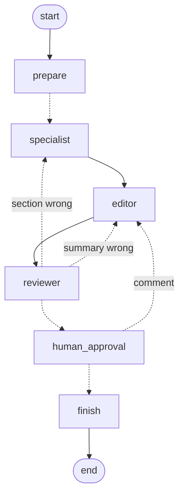

# Can a Team of Small AI Agents Explain Where a Detector Fails, Without Making Things Up?

   -orange)  [](https://github.com/knh4abt/perception-triage-agent/actions/workflows/ci.yml)

YOLOv8n looks at 200 street photos. Code measures where it fails. Then three small AI
agents each explain one part of the failure, an editor writes the summary, and a reviewer
checks every claim against the measured numbers. If a claim is wrong, only the agent that
wrote it has to fix it.

Everything runs locally and for free: Llama 3.1 8B through Ollama, no cloud API.

<p align="center">
  <br/>
  <sub>A real catch from a run: the agent said "darker", the measured brightness says "brighter".</sub>
</p>

---

## What the detector gets wrong

**It misses small objects.** Persons smaller than 32x32 pixels are found 37% of the time,
large persons 97%. The single biggest failure: **227 of 360 small persons were missed**.

| Class | Recall, small | Recall, medium | Recall, large |
|---|---:|---:|---:|
| person | 0.369 (227 of 360 missed) | 0.801 | 0.966 |
| car | 0.216 (58 of 74 missed) | 0.655 | 0.714 |
| bus | 0.167 (6 objects) | 0.375 | 0.875 |
| truck | 0.250 (8 objects) | 0.333 | 0.429 |

**The hardest images are crowded, not dark.** I expected night scenes to be the problem,
because the clearest failure is a night photo (12 tiny cars, none found). The image
statistics say otherwise:

| | 10 hardest images | all 200 images |
|---|---:|---:|
| objects per image | 13.5 | 4.9 |
| median object size (pixels) | 242 | 3728 |
| share of small objects | 84% | 28% |
| mean brightness (0-255) | 128.0 | 112.9 |
| dark images | 1 of 10 | 22 of 200 |

<p align="center">
  <br/>
  <sub>000000490936.jpg, the hardest image: 4 of 16 objects found. Green: found. Red: missed.</sub>
</p>

Mixing up classes is rare: a car was detected as a truck 4 times, a truck as a bus 2 times,
a truck as a car 2 times. Overall precision is 0.822 and recall 0.603 (confidence 0.25,
IoU 0.5, 985 labelled objects).

---

## How the agents work

```
prepare        code: run YOLOv8n, compare with labels, measure each image
   |
   +--> size agent          "how does object size matter?"
   +--> confusion agent     "which classes get mixed up?"      (run in parallel)
   +--> hard-image agent    "what do the hardest images share?"
   |
editor         writes the summary and 2-3 recommendations
   |
reviewer       checks every section; wrong section -> back to its agent (max 2 rounds)
   |
you (optional) approve or comment before the report is saved   (--approve)
   |
report.md      agent text + tables written by code
```

- **Each agent only gets the tools for its own question.** The tools come from two small
  MCP servers: one for detection metrics, one for image statistics.
- **The reviewer is mostly code.** It checks that every number exists in the measured
  data, that the biggest failure is stated exactly, that "A detected as B N times" matches
  the confusion table, and that "darker/brighter" matches the measured brightness.
- **The LLM part of the reviewer has to quote** the sentence it thinks is wrong and the
  fact that contradicts it. Code throws away complaints whose quote is not really in the
  text, or whose "fact" says the same thing as the sentence.
- **Problems that remain after 2 rounds are printed at the end of the report**, not hidden.

<details>
<summary>The LangGraph graph (simplified from the generated reports/graph.md)</summary>



`specialist` runs three times in parallel (LangGraph `Send`); a reducer merges their
sections. `human_approval` pauses the graph with `interrupt` and a checkpointer.
</details>

---

## What went wrong while building it

Every fix moved work from the model to code. The ones that mattered most:

| Problem the 8B model caused | Why the existing checks missed it | Fix |
|---|---|---|
| Wrote "360 small persons missed" (360 is the total, 227 were missed) | 360 does exist in the data | The tool returns "227 of 360 missed" as a sentence; code requires that exact count |
| The LLM reviewer flagged almost every sentence, correct ones included | It was asked to judge everything at once | One call per section, with a quote and a fact; code filters what it returns |
| Called the hard images "darker" (they are brighter) | Both brightness numbers were real | Code compares the claim with the measured brightness |
| Wrote "truck detected as car 13 times" (it is 2; 13 is the truck false-alarm count) | 13 exists in the data | Code checks each confusion claim against the table |
| Invented "image 12345, brightness 130" | | The number check caught it: neither number exists |
| The editor seemed to hang | In forced-JSON mode the model sometimes never stops | Every call has a token limit; the editor writes plain text that code parses |

Example output: [`reports/report.md`](reports/report.md). In that run one real mistake
survived both review rounds (the confusion agent named person as the lowest-precision
class; it is truck). The code check caught it and it is listed under "Reviewer notes" at
the end, next to some false alarms from the LLM reviewer.

---

## Design decisions

| Decision | Alternative I did not take | Why |
|---|---|---|
| Three specialists in parallel, fixed in code | One LLM "supervisor" agent that decides who runs | Every report needs all three; letting an 8B model route would only add a way to fail |
| Each agent sees only its own tools | Every agent gets all tools | Shorter prompts for a small model, and a clear owner for every section |
| Reviewer sends a section back to its owner only | Rewrite the whole report | Faster rounds; a correct section is never put at risk again |
| Code writes all tables and headings | The LLM writes the whole report | The model changed formats and invented numbers when it copied tables |
| Reviewer reads the data from disk | Reviewer trusts what the agents looked at | A check must not share the blind spots of what it checks |
| Tools behind two MCP servers | Plain Python imports | Agents and tools are decoupled; the metrics server already runs over HTTP for deployment |
| Local Llama 3.1 8B | A large hosted model | Free and private, and its mistakes are visible, which is what this project studies |

## How I know it works

Each rule the report must follow is enforced by code and proven by a unit test. Most tests
use the exact mistake an agent made in a real run.

| Rule for the report | Enforced by | Test |
|---|---|---|
| Every number exists in the measured data | `check_numbers` | `test_check_numbers_flags_invented_value` |
| The biggest failure is stated with its exact missed count | `check_coverage` | `test_coverage_rejects_total_written_as_missed` |
| "A detected as B N times" matches the confusion table | `check_confusion_claims` | `test_confusion_claims_must_match_the_table` |
| The lowest-precision class is named correctly | `check_lowest_precision` | `test_lowest_precision_must_name_the_right_class` |
| "Darker/brighter" matches the measured brightness | `check_brightness_claims` | `test_brightness_claim_must_match_measurement` |
| LLM-review complaints quote real text and a fact that disagrees | `grounded_issues` | `test_reviewer_issue_dropped_when_its_fact_agrees_with_the_sentence` |
| A rewrite goes only to the agent that owns the section | `fan_out` | `test_fan_out_sends_only_failed_sections_with_their_feedback` |
| Parallel agents never overwrite each other | `merge_dicts` reducer | `test_merge_dicts_keeps_parallel_sections_and_replaces_rewrites` |
| The whole graph runs end to end | `build_graph` | `test_full_graph_runs_and_assembles_report` (scripted fake LLM) |

What is not covered by a test: whether the LLM reviewer judges well. That is measured per run
in `reports/run_log.json`, and the open issues are printed in the report.

Other engineering habits in this repo:

- **Reproducible data:** fixed seed for the 200 images; the label file is checked against the
  official COCO counts after download.
- **Every LLM call is bounded:** a token limit per answer and a limit on loop rounds, after a
  call that never stopped generating.
- **Pinned versions for deployment:** an open version range once pulled a new major release
  of the MCP library into the container and broke it on start.
- **CI on every push:** linter, 33 tests and a Docker build with a start-up check.

---

## Run it

You need Python 3.11 and [Ollama](https://ollama.com). A GPU helps but is not required.

```bash
python -m venv .venv
source .venv/Scripts/activate        # Linux/macOS: source .venv/bin/activate
pip install -r requirements.txt
ollama pull llama3.1:8b

python -m scripts.download_data                     # 200 images and labels, about 60 MB
python -m triage_agent.cli                          # about 4 minutes, writes reports/report.md
python -m triage_agent.cli --approve                # same, but you approve before it is saved
python -m pytest -q                                 # 33 tests, no LLM needed
```

The console shows each step as it happens (which agent ran, which tools it called, what the
reviewer sent back). Every review round is saved in `reports/run_log.json`.

On every push, GitHub Actions runs the linter, the tests and a Docker build.

**Deployment (in progress):** `deploy/metrics-space/` packs the metrics tools into a small
container (a web page plus an MCP server, no LLM needed). It runs locally with Docker;
free cloud hosting is the next step.

---

## Limitations

- One run is an anecdote. Reports differ between runs, and some runs still end with
  unresolved reviewer notes.
- The code checks cover the claims I have seen go wrong. A new kind of mistake needs a new
  check, and the LLM reviewer still raises some false alarms.
- 200 images is small. Bus (22 objects) and truck (30) numbers are uncertain.
- Ollama on a 6 GB GPU answers one request at a time, so the parallel agents are parallel in
  the design, not in speed.
- Labels come from a Hugging Face copy of COCO because the official server was blocked on
  my network. The download script checks the copy against the official counts.

## Next steps

- Run the pipeline many times and report how often each check catches something.
- Free cloud hosting for the tools server, and a small GUI.
- A larger LLM on the same checks, to see which checks it still needs.

---

## Project structure

```
configs/default.yaml        settings: paths, thresholds, LLM, revision limit
scripts/                    data download, deploy package, server check
triage_agent/
  detector.py, metrics.py   YOLOv8n predictions and the comparison with labels
  image_stats.py            brightness, objects per image, object size
  tools.py                  the functions the agents can call
  mcp_servers/              two MCP servers: metrics and images
  agents.py                 the three specialists and the editor
  graph.py                  the LangGraph workflow
  review.py                 code checks and the LLM reviewer
  report.py                 report.md layout and tables
  cli.py                    entry point
tests/                      unit tests, no LLM calls
deploy/                     container for the tools server
```

## References

- Lin et al., Microsoft COCO: Common Objects in Context, ECCV 2014 (annotations CC BY 4.0)
- Ultralytics YOLOv8, https://github.com/ultralytics/ultralytics (AGPL-3.0)
- LangGraph, https://github.com/langchain-ai/langgraph
- Model Context Protocol, https://modelcontextprotocol.io
- Meta Llama 3.1, run with Ollama

## License

MIT. YOLOv8 itself is AGPL-3.0. The COCO data is not included; the script downloads it.
