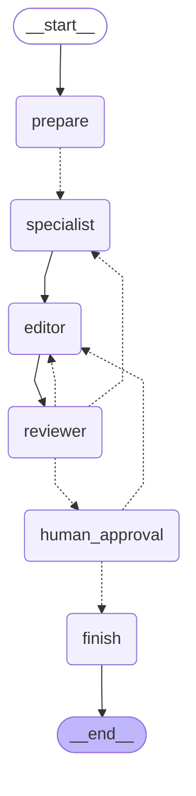

```mermaid
---
config:
  flowchart:
    curve: linear
---
graph TD;
	__start__([<p>__start__</p>]):::first
	prepare(prepare)
	specialist(specialist)
	editor(editor)
	reviewer(reviewer)
	human_approval(human_approval)
	finish(finish)
	__end__([<p>__end__</p>]):::last
	__start__ --> prepare;
	editor --> reviewer;
	human_approval -.-> editor;
	human_approval -.-> finish;
	prepare -.-> specialist;
	reviewer -.-> editor;
	reviewer -.-> human_approval;
	reviewer -.-> specialist;
	specialist --> editor;
	finish --> __end__;
	classDef default fill:#f2f0ff,line-height:1.2
	classDef first fill-opacity:0
	classDef last fill:#bfb6fc
```
